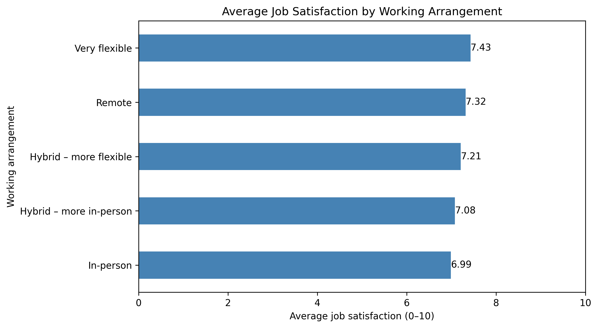
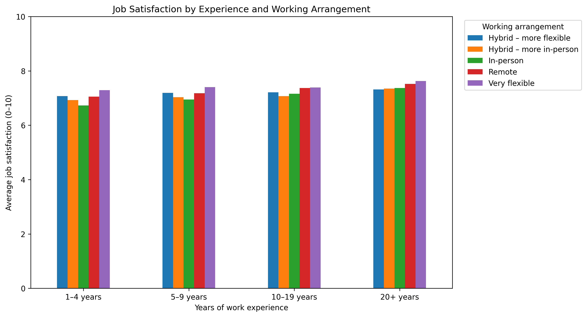
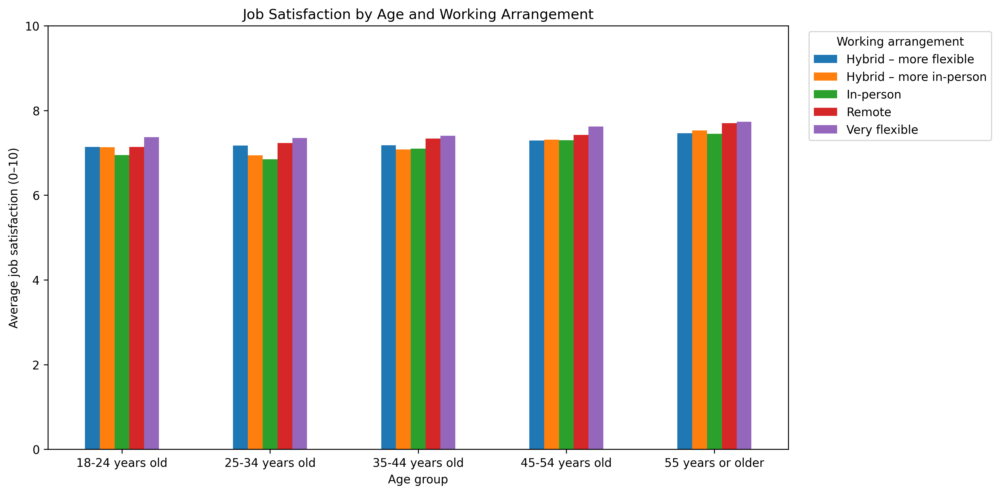

# Work Flexibility and Job Satisfaction in Tech

An exploratory analysis of working arrangements and job satisfaction using the 2025 Stack Overflow Developer Survey.

## Project overview

This project investigates whether working arrangements are associated with job satisfaction among survey respondents. It also examines whether satisfaction patterns differ by work experience and age.

## Research questions

1. Is working arrangement associated with job satisfaction?
2. Does the relationship change with years of work experience?
3. Does the relationship change across age groups?

## Dataset

The project uses the [2025 Stack Overflow Developer Survey](https://survey.stackoverflow.co/).

* Total survey responses: 49,191
* Responses used in the main analysis: 22,797
* Variables analysed: working arrangement, job satisfaction, work experience, and age

## Tools

* Python
* pandas
* Matplotlib
* Google Colab

## Method

The analysis selected the relevant survey columns, examined missing values, and retained respondents who answered both the working-arrangement and job-satisfaction questions. Three unrealistic work-experience values were removed. Respondents were then grouped by experience and age, and average satisfaction scores were compared across working arrangements.

## Key findings

* Very flexible respondents reported the highest overall average satisfaction (7.43), while in-person respondents reported the lowest (6.99).
* Average satisfaction generally increased with work experience. Scores ranged from 6.73 for in-person respondents with 1–4 years of experience to 7.63 for very flexible respondents with 20 or more years.
* Satisfaction also generally increased across older age groups. The lowest average was 6.85 for in-person respondents aged 25–34, while the highest was 7.73 for very flexible respondents aged 55 or older.
* The differences were small, so working arrangement is likely only one of several factors related to job satisfaction.

## Visualisations

### Overall working arrangement

### Work experience

### Age group

## Limitations

* The voluntary survey may not represent everyone working in technology.
* Many respondents did not answer the questions needed for this analysis.
* Job satisfaction was self-reported.
* Other factors—such as salary, job role, country, and company culture—were not investigated.
* This descriptive analysis did not perform statistical significance tests.
* The findings show associations and do not prove cause and effect.

## Notebook

[View the complete analysis notebook](remote_work_job_satisfaction %281%29.ipynb)
